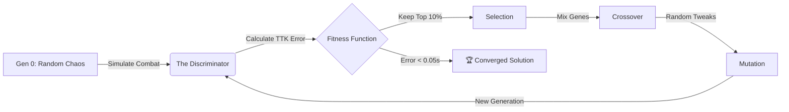

# ⚔️ Genesis Module 1: Automated Weapon Balancer


> **"Balancing game items shouldn't be a guessing game. It should be a math problem."**

## 📋 Executive Summary
In modern MMOs, introducing a new weapon often breaks the game meta. Developers spend weeks manually tweaking damage numbers to ensure fairness.

**The Solution:** The **Genesis Weapon Balancer** is an autonomous agent that uses **Evolutionary Computation (Genetic Algorithms)** to procedurally generate weapons. You define the *Constraint* (e.g., "I need a Sniper Rifle that kills an Orc in exactly 5.0 seconds"), and the AI "breeds" thousands of weapon variants until it evolves the mathematically perfect configuration.

---

## 🚀 Key Features
* **🧬 Genetic Evolution Engine:** Implements Selection, Crossover, and Mutation to traverse the search space efficiently.
* **⚡ Real-Time Visualization:** Watch the AI converge on the solution live via a Streamlit Dashboard.
* **🎯 Target-Based Optimization:** Solves for specific "Time-To-Kill" (TTK) targets against different Enemy archetypes (Mob, Elite, Boss).
* **🛑 Efficiency Optimization:** Includes "Early Stopping" logic to halt computation once the solution is within a 99% confidence interval.

---

## 🛠️ System Architecture

The system mimics natural selection to find optimal numerical values.



## 💻 Tech Stack
Core Logic: Python 3.10

Data Processing: Pandas, NumPy

Visualization: Streamlit

Simulation Physics: Custom discrete-event combat loop.

## 🏃 Getting Started

1. Clone the Repository
```Bash
git clone [https://github.com/ryangilbert-github/genesis-weapon-balancer.git](https://github.com/ryangilbert-github/genesis-weapon-balancer.git)
cd genesis-weapon-balancer
```
2. Install Dependencies
```Bash
pip install pandas numpy streamlit
```
3. Run the AI Dashboard
```Bash
python -m streamlit run weapon_dashboard.py
```

## 📊 The Math (Fitness Function)
The AI minimizes the Error Score defined as:

$$ Error = | \text{Ideal TTK} - \text{Actual Simulated TTK} | $$

Where Actual TTK includes reload penalties: $$ TTK = \left( \frac{\text{Shots to Kill} - 1}{\text{Fire Rate}} \right) + (\text{Reloads} \times \text{Reload Time}) $$

## 🔮 Future Roadmap
[ ] Multi-Objective Optimization: Optimize for both TTK and "Ammo Economy" simultaneously.

[ ] Reinforcement Learning: Replace Genetic Algorithm with PPO (Proximal Policy Optimization) for complex ability rotations.

[ ] Unreal Engine Bridge: Auto-export JSON directly to a game server.

Author: Ryan Gilbert

Generative AI Engineer & Systems Architect